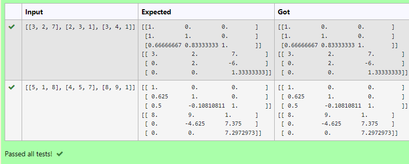
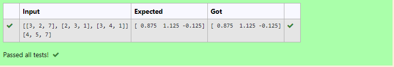

# LU Decomposition 

## AIM:
To write a program to find the LU Decomposition of a matrix.

## Equipments Required:
1. Hardware – PCs
2. Anaconda – Python 3.7 Installation / Moodle-Code Runner

## Algorithm
1.Read the elements of augmented matrix into arrays a and b
2.Calculate elements of L and U
3.Print elements of L and U
4.Find V by solving LV = B by forward substitution
5.Find X by solving UX = V by backward substitution
6.Print Array X as the solution

## Program:
(i) To find the L and U matrix
```
/*
Program to find the L and U matrix.
Developed by: Ritika S
RegisterNumber: 21001175
*/
```
import numpy as np 
import scipy
from scipy.linalg import lu
A=np.array(eval(input()))
p,l,u=lu(A)
print(l)
print(u)

### Output:

(ii) To find the LU Decomposition of a matrix
```
/*
Program to find the LU Decomposition of a matrix.
Developed by: Ritika S
RegisterNumber: 21001175
*/
```
import numpy as np
import scipy
from scipy.linalg import lu_factor,lu_solve
A=np.array (eval(input()))
B=np.array (eval(input()))
lu,piv=lu_factor(A)
x=lu_solve((lu,piv),B)
print(x)


## Output:



## Result:
Thus the program to find the LU Decomposition of a matrix is written and verified using python programming.

